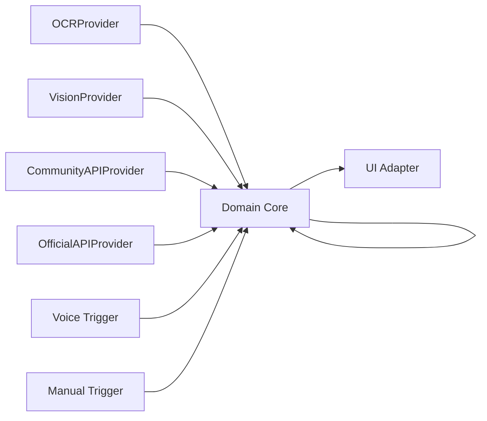
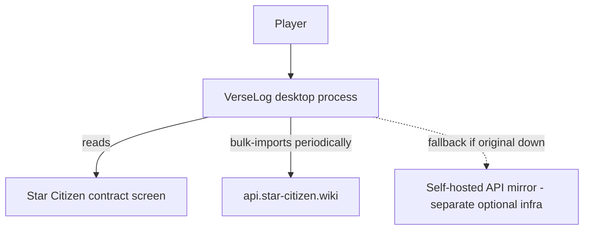

# Architecture Spine — VerseLog

## Design Paradigm

**Ports & Adapters (Hexagonal).** A domain core (trust layer, route/cargo optimizer, config) defines the interfaces ("ports") it needs; every concrete technology — capture method, data source, trigger, UI — is an adapter implementing one of those ports. The core never imports a concrete adapter.



## Invariants & Rules

### AD-1 — Ports & Adapters paradigm

- **Binds:** all
- **Prevents:** a new provider or trigger being wired straight into domain logic instead of behind a port, causing divergent coupling as the app grows.
- **Rule:** the domain core must never import a concrete adapter module. Adapters depend on core-defined port interfaces; never the reverse.

### AD-2 — Language/runtime `[ADOPTED]`

- **Binds:** all
- **Prevents:** a component picked in an incompatible runtime.
- **Rule:** Python, 3.12+ floor. (Current stable is 3.14.6; 3.12 is the safe compatibility floor since OCR/vision-model library ecosystems lag the newest Python release.)

### AD-3 — Trust layer is one service

- **Binds:** CAP-1, CAP-2
- **Prevents:** each capture provider growing its own inconsistent validation/quarantine rules.
- **Rule:** every provider's raw extraction passes through one trust-layer service (validation, quarantine, confidence scoring) before anything downstream sees it. No provider implements its own validation path.

### AD-4 — Local reference-data store

- **Binds:** CAP-4, CAP-8
- **Prevents:** contributors inventing different local storage formats for the same imported dataset.
- **Rule:** bulk-imported community-API reference data (cargo capacities, fuel defaults, location data) lives in one local SQLite file owned by the domain core. No scattered JSON/CSV copies.

### AD-5 — Single-process execution

- **Binds:** CAP-1, CAP-3
- **Prevents:** a background daemon/service split adding always-on resource cost.
- **Rule:** the app is one long-running desktop process; extraction models load lazily at scan time and unload after, in-process.

### AD-6 — Parallel capture, serial trust layer

- **Binds:** CAP-1, CAP-2, CAP-3
- **Prevents:** either missing the bulk-scan case (dozens of contracts visible at once) or letting parallel workers race on shared quarantine/confidence state.
- **Rule:** capture/extraction may run on a pool of 1..N workers, N set by the benchmark (AD-8). Every worker's result is queued into the single trust-layer service (AD-3) serially — no worker writes quarantine/confidence state directly.

### AD-7 — Single settings store

- **Binds:** CAP-3, CAP-5, CAP-8
- **Prevents:** settings (time-budget threshold, reputation level, per-ship engine overrides, benchmark results) drifting into multiple ad hoc files.
- **Rule:** one local settings store owned by the domain core; adapters read it, never write it directly.

### AD-8 — Benchmark determines model tier + worker count together

- **Binds:** CAP-3
- **Prevents:** treating model-tier selection and parallelism as unrelated decisions, which could lock in a worker count that no longer fits after a tier change (or vice versa).
- **Rule:** the benchmark routine (automatic on first launch/hardware change, or manually re-run from settings) outputs both the model tier and the safe worker count N in the same pass.

## Consistency Conventions

| Concern | Convention |
| --- | --- |
| Naming | Ports are named `<Noun>Port`; adapters `<Tech><Noun>Adapter` (e.g. `OllamaVisionAdapter`). |
| Data & formats | One `Contract` model (departure, arrival, SCU, reward, remaining-time\|None) is the only shape crossing a port boundary. |
| State & cross-cutting | All mutable app state (settings, quarantine, imported reference data) lives in the local SQLite store owned by the core; adapters are stateless where possible. |

## Stack

| Name | Version |
| --- | --- |
| Python | 3.12+ (current stable 3.14.6) |
| Ollama | current stable (2026) — local vision-model runtime |
| Tesseract / pytesseract | current stable — classic OCR fallback tier |
| SQLite (stdlib `sqlite3`) | bundled with Python |
| Tkinter (stdlib) | bundled with Python — seed UI, swappable (see Deferred) |

## Structural Seed

```text
verselog/
  core/               # domain: trust layer, route/cargo optimizer, Contract model, settings store
    ports/            # interfaces adapters implement: Capture, DataSource, Trigger, UI
  adapters/
    capture/          # OCRProvider, VisionProvider (Ollama-backed), worker pool + benchmark
    datasource/       # CommunityAPIProvider (SQLite-backed local mirror), OfficialAPIProvider (stub, non-goal for now)
    trigger/          # voice (VoiceAttack, Windows-only), manual (all platforms)
    ui/                # Tkinter seed
  data/               # local SQLite file(s)
  tests/
```



## Capability → Architecture Map

| Capability | Lives in | Governed by |
| --- | --- | --- |
| CAP-1 (capture/extraction) | `adapters/capture/` | AD-1, AD-6, AD-8 |
| CAP-2 (trust layer) | `core/` | AD-3, AD-6 |
| CAP-3 (adaptive benchmark) | `adapters/capture/` (routine) + `core/` (settings) | AD-2, AD-6, AD-7, AD-8 |
| CAP-4 (route/cargo optimization) | `core/` | AD-1, AD-4 |
| CAP-5 (legality/reputation) | `core/` + `adapters/ui/` | AD-7 |
| CAP-6 (flexible triggering) | `adapters/trigger/` | AD-1 |
| CAP-8 (fuel config default/override/reset) | `core/` + `adapters/datasource/` | AD-4, AD-7 |

## Deferred

- **UI toolkit beyond the Tkinter seed** — swappable, not an invariant; revisit if Tkinter's look becomes a real adoption blocker.
- **Route/knapsack optimization algorithm specifics** — an implementation detail inside `core/`, not a cross-adapter divergence point.
- **SQLite schema** — owned by the code once `core/` exists.
- **Packaging/distribution format** (PyInstaller, Nuitka, or other) — revisit once there's a first working build to ship.
- **CI pipeline and testing framework choice** — revisit once the source tree has real code to test.
- **VoiceAttack plugin integration mechanics** — implementation detail inside `adapters/trigger/`.
- **Mirrored community-API server hosting** — separate optional infra (see AD's operational note); not required to ship v1.
- **Official CIG API adapter** — non-goal for now per SPEC.md; the port exists (`OfficialAPIProvider`) but stays unimplemented.
- **Tablet/second-device access** — flagged 2026-07-09, explicitly not designed yet, two open directions with a real tradeoff neither picked:
  - *Remote display*: the PC engine runs exactly as built; a future `UIPort` adapter additionally serves results over the local network (self-hosted, no cloud, no cost) so a tablet/phone/second PC can view them. Small, low-risk addition once the first `UIPort` adapter exists — doesn't touch AD-2 or AD-5.
  - *Compute offload*: the PC sends a captured screenshot to a second device and that device runs the OCR/vision extraction instead, freeing the gaming PC's CPU/GPU during a scan (directly serves the CPU-load constraint above). A materially bigger bet: breaks AD-5's single-process model (needs a real PC↔device protocol), Tesseract is plausibly portable but Ollama's vision models are not (no iOS support, effectively no Android support today — would need a different mobile inference stack), and a weaker second device could make scans slower, not faster.
  - Neither is scheduled. Revisit with a dedicated architecture session before committing to either — don't let a future `UIPort` adapter silently assume one over the other.
